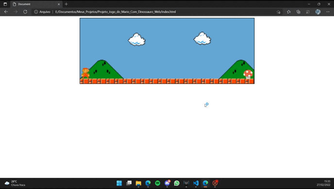

<h2>Jogo de Mario/Dino usando HTML5, CSS3 e JavaScript</h2>

     
    
Tela de Jogo

  

<h2>Criação</h2>

Criado utilizando as linguagens padrões de devenvolvimento web.
  
Estou programando em front-end para distrair e mudar um pouco meu foco em back-end, além do mais, acaba compreendendo vários aspectos do front-end para futuros projetos.

